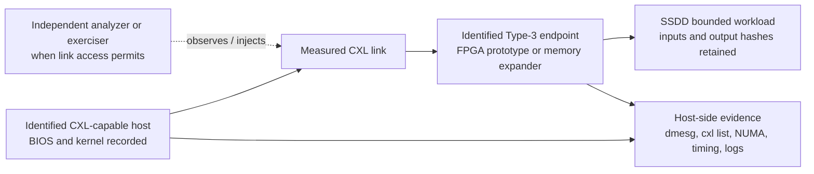

# Real-CXL Hardware Path: Source Register

## Status

This register records **external discovery sources only** for a future independent CXL hardware route. It is not a procurement decision, a platform qualification, an SSDD hardware result, or evidence that SSDD has run on an FPGA or a real CXL link. No real CXL hardware is available in the current validation environment.

## Candidate categories

| Category | Candidate evidence | What the source establishes | What it does not establish for SSDD |
| --- | --- | --- | --- |
| FPGA CXL endpoint capability | [Altera Compute Express Link IP][1] | The vendor describes FPGA CXL IP for Type 1, Type 2, and Type 3 device development. | Availability to this project, host-platform compatibility, an implemented SSDD core, synthesis closure, or hardware execution. |
| FPGA CXL prototype board | [Agilex 7 I-Series development kit][2] | The vendor presents a board intended for PCIe 5.0, CXL, and high-speed networking prototyping, with PCIe/CXL x16 connectivity described on the product page. | Procurement, a compatible host insertion path, licensed IP access, working endpoints, or SSDD execution. |
| Intel host candidate | [4th Gen Intel Xeon overview][3] | Intel describes 4th Gen Xeon as offering PCIe Gen 5.0 with Flex Bus/CXL lanes. | A particular server-board BIOS configuration, endpoint interoperability, or a Type-3 result for SSDD. |
| AMD host candidate | [AMD EPYC 9004 CXL paper][4] | AMD describes EPYC 9004 CXL support, 64 CXL-capable lanes, and focus on Type-3 devices. | That a selected EPYC server exposes a compatible CXL slot, supports the selected device, or has been tested for SSDD. |
| Independent protocol validation tooling | [Teledyne LeCroy CXL compliance testing][5] | The vendor describes analyzer, exerciser, and PCIe test-platform components for endpoint validation, verification, error injection, and compliance work. | That SSDD is compliant, interoperable, or tested by those tools. |
| CXL test-vendor context | [CXL Consortium Teledyne note][6] | The Consortium identifies Teledyne LeCroy as a recognized test vendor for CXL test events and describes an analyzer/exerciser use case. | A completed SSDD validation session or vendor endorsement. |
| FPGA-backed Type-3 research prototype | [HeteroBox / HeteroMem][7] | The paper reports use of Intel FPGA CXL Type-3 IP and custom Verilog in its own experimental design. | Transferability to SSDD, independent reproducibility here, or a reusable SSDD device implementation. |
| Full-system CXL simulation cross-check | [CXL-DMSim][8] | The cited work describes a full-system CXL disaggregated-memory simulator with silicon-validation context. | A real-hardware result for SSDD or a substitute for independent protocol analysis. |

## Candidate topology and measurement boundary

The diagram is a future experimental topology, not a depiction of deployed SSDD hardware. The host, endpoint, analyzer, and firmware revision must be recorded together because compatibility and observability are platform-specific.

| Measurement stage | Retained record | Acceptance boundary |
| --- | --- | --- |
| Topology preflight | Host and board identifiers, firmware and BIOS settings, `lspci`, kernel `dmesg`, `cxl list`, NUMA view, device serials where available | Confirms only that the host enumerates the intended device and memory topology. |
| Endpoint bring-up | RTL/bitstream hash, IP and tool version, link width/rate, reset and error logs | Confirms only the programmed endpoint status. |
| SSDD workload execution | Immutable input manifest, binary/RTL hash, output batches, state/proof hashes, exit codes, wall-clock and monotonic timestamps | Supports workload-specific correctness and timing analysis, not protocol compliance by itself. |
| Link observation | Analyzer/exerciser model and configuration, capture identifier, trigger definition, trace checksum | Supports independently observed link behavior or controlled error-injection evidence. |
| Replay and disposition | Repeated runs, pass/fail criteria fixed before execution, all raw logs and failed cases preserved | Allows a bounded `real_cxl_hardware` conclusion only for the demonstrated configuration. |

## Present blockers

The current environment has no CXL-capable host, endpoint board, vendor CXL IP entitlement, target-specific timing closure, analyzer/exerciser access, or physical link capture. Altera also documents a version-specific Agilex 7 R-Tile CXL IP issue whose workaround requires additional RTL capability-register work; any selected release must therefore be independently reviewed before use.[9]

This is a planning and source-discovery record only. Procurement, platform selection, or a declaration that a particular device will work remain out of scope until those physical resources and compatibility checks exist.

## Required future gate before any hardware claim

An SSDD result may be classified as `fpga_hardware` only when the selected RTL has been synthesized, loaded, and **executed on identified FPGA hardware**, with retained board, bitstream, clock, input, output, and measurement evidence. It may be classified as `real_cxl_hardware` only when the same evidence chain additionally records a real CXL-capable host/device topology and the applicable independent observation or protocol-test evidence. Synthesis, place-and-route, RTL simulation, and SimCXL runs remain distinct domains.

## References

[1]: https://www.altera.com/products/ip/po-3099/compute-express-link-cxl-ip "Altera — Compute Express Link (CXL) IP"
[2]: https://www.intel.com/content/www/us/en/products/details/fpga/development-kits/agilex/agi027.html "Agilex 7 FPGA I-Series Development Kit"
[3]: https://www.intel.com/content/www/us/en/developer/articles/technical/fourth-generation-xeon-scalable-family-overview.html "Intel — Technical Overview of the 4th Gen Xeon Scalable Processor Family"
[4]: https://docs.amd.com/api/khub/documents/n5EFiNY3BkgFFAMJg2xWgg/content "AMD — DDR5 and CXL Support in EPYC 9004"
[5]: https://www.teledynelecroy.com/protocolanalyzer/cxl/cxl-compliance-testing "Teledyne LeCroy — CXL Compliance Testing"
[6]: https://computeexpresslink.org/blog/teledyne-lecroy-to-demonstrate-protocol-analyzer-and-protocol-exerciser-for-cxl-3-x-at-devcon-2025-3829/ "CXL Consortium — Teledyne LeCroy CXL 3.X Demonstration"
[7]: https://arxiv.org/html/2502.19233v2 "FPGA-based Emulation and Device-Side Management for CXL Memory"
[8]: https://ieeexplore.ieee.org/abstract/document/11153390/ "CXL-DMSim: A Full-System CXL Disaggregated Memory Simulator with Comprehensive Silicon Validation"
[9]: https://www.intel.com/content/www/us/en/support/programmable/articles/000097527.html "Intel — Agilex 7 R-Tile CXL IP ATS capability issue"
